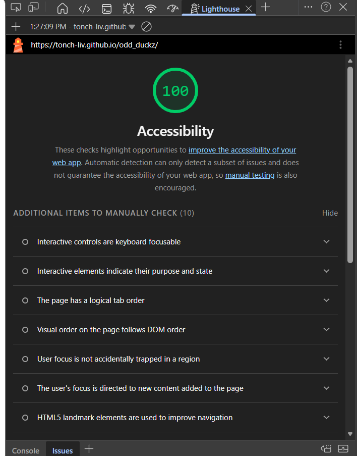
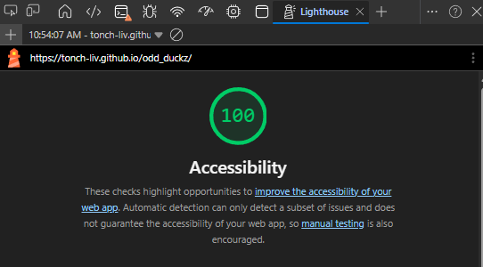

# odd_duckz

votes, votez, VOTES!

- 03.10.26
  - added base files (html, css, js, json).
  - added image assets.
  - created img placeholders in html with ids, added basic styling format to keep image dimensions same regardless of image.
  - created constructor that stores image file name / path, # of times shown, and times clicked.
  - created static `allProducts` property that pushes to global array.
  - defined new object instances
  - created js variables to select html elements
  - created `renderProducts()` fucntion to generate three random pictures, ensure no duplicates are shown, increase counter, etc. (notes included in js).
  - added global variable to track 25 rounds.
  - created reference for container through html id link.
  - added event listener for click and click handler for execution, added function invocation.
  - images load on browser, will need to edit orentation and dimensions; fixed spelling on 'cthulhu' image so it would populate.
  - fixed spelling in `<head>` for styles.css link; was missing 's' off 'styles'.
  - speeling error within css was also preventing styles from applying; renaming of id.
  - crated `results()` function.
  - fixed issue on lists not updating / voting results being added to 'master' list, now results only show up after voting has completed with only choices displayed (and voted on); sans items not displayed.

- 03.12.26
  - added 'use strict'
  - added lighthouse report, before branch; 100%
  - 
- dataviz branch
  - linked Chart.js in nested `<script>` element within `<head>`, added `<canvas>` element (with `id=resultsChart`).
  - created chart function,
  - renamed `eslitor.json` to `eslintrc.json`.
  - rearranged order of javascript by moving click handler till after `renderChart()`.
  - added comments to `renderChart()`.
  - moved results locations from `<aside>` to below pictures and sidexside of chart.
  - created flexbox container to hold results and chart. updated comments abput DOM `.getElementById` to reflect being linked to `
`, not `<aside>`.
  - added styling for `results_Container`, `resultsChart`, and `results`.

- 03.16.26
  - refactored `renderProducts()` function to account for checking not only duplicates in active round, but also repeated images in following rounds, and also accounts if need to regenerate new images. (added array toward end of function to store previous indexes).
  - included a method to clear list, should new voting instace begin to avoid stackig list inside `showResults()`
  - modified click to specify click needs to happen on image not including container around it.
  - added button to add ability to restart voting without need to refresh page.
  - specified desctruction / clearing of old chart to avoid odd behavior.
  - merged dataViz with main branch, will style on next loadout.

- 03.17.26
  - added updated lighthouse report after merging viz branch.
  - 
  - branch created (dataStore).
  - began styling; added css selctors for `<body>` and `<main>`.
  - modified `product_Container` selector; widens gap between images as well as margin on top and bottom.
  - added container for products, white background.
  - added a placeholder container for results.
  - styled results.
  - styled and centered button.
  - modified chart loading aspects.
  - adding h1 heading.
  - changed chart colors.
  - styled iomages to zoom on hover.
  - added fixed height to product container.
  - changed background color.
  - added variables for html/dom id's; `results` and `results_Container`.
  - broke chart.js.
  - fixed styling on header and h1.
  - added transiiton for results container (still needs testing).
  - changed color on button.
  - deleted aside and extra section in html.
  - 
